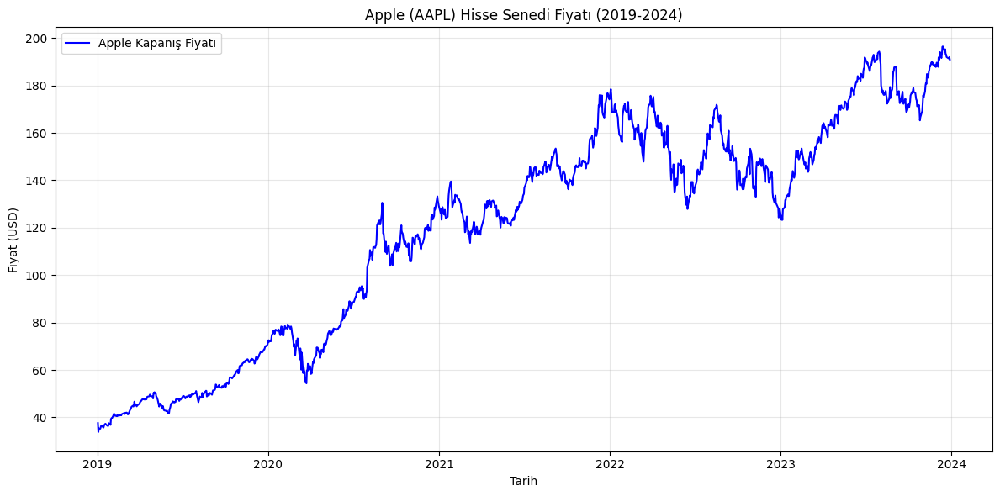
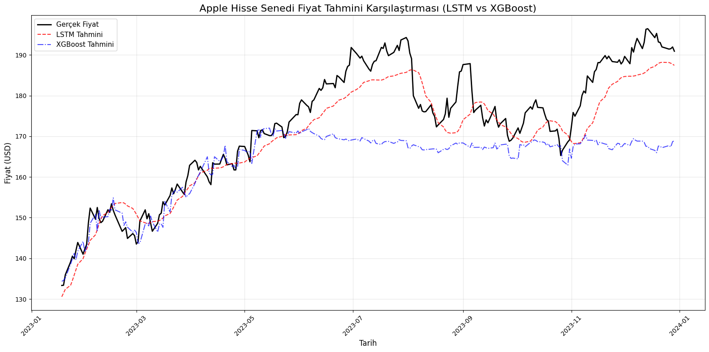

# 📈 Apple (AAPL) Hisse Senedi Fiyat Tahmini Projesi

Bu proje, **Apple Inc. (AAPL)** hisse senedi kapanış fiyatlarını tahmin etmek için **LSTM (Derin Öğrenme)** ve **XGBoost (Makine Öğrenmesi)** modellerini kullanır. Amacımız, geçmiş fiyat hareketlerine dayanarak gelecekteki fiyatları tahmin etmek ve modellerin performansını karşılaştırmaktır.

---

## 🎯 Amaç
- Geçmiş 60 günün kapanış fiyatını kullanarak bir sonraki günün fiyatı tahmin edilir.
- LSTM ve XGBoost modellerinin performansı karşılaştırılır.
- Zaman serisi tahmini için en uygun model belirlenir.

---

## 📊 Veri Kaynağı
- **Sembol**: `AAPL` (Apple Inc.)
- **Kaynak**: Yahoo Finance (`yfinance`)
- **Zaman Aralığı**: 2019-01-01 ile 2024-01-01
- **Frekans**: Günlük
- **Kullanılan Sütun**: `Close` (Kapanış Fiyatı)
- **Toplam Veri Noktası**: ~1,257 gün
- **Normalizasyon**: `MinMaxScaler` (0–1 arası)

---

## 🧠 Kullanılan Modeller

### 1. **LSTM (Long Short-Term Memory)**
- **Tür**: Derin öğrenme, RNN tabanlı
- **Katmanlar**:
  - LSTM (50 nöron, `return_sequences=True`)
  - LSTM (50 nöron, `return_sequences=False`)
  - Dense (25 nöron, ReLU aktivasyonu)
  - Dense (1 çıkış, fiyat tahmini)
- **Optimizatör**: Adam (learning_rate=0.001)
- **Loss Function**: Mean Squared Error (MSE)
- **Epochs**: 20
- **Batch Size**: 32
- **Giriş Şekli**: `(batch_size, 60, 1)` → 60 gün geçmiş, 1 özellik

### 2. **XGBoost (Extreme Gradient Boosting)**
- **Tür**: Ağaç tabanlı makine öğrenmesi
- **Parametreler**:
  - `n_estimators=100`
  - `max_depth=6`
  - `learning_rate=0.1`
  - `random_state=42`
- **Giriş Şekli**: 2D dizi → `(batch_size, 60)`

---

## 🔧 Teknik Detaylar
| Özellik | Değer |
|--------|-------|
| **Zaman Penceresi** | 60 gün |
| **Eğitim/Test Oranı** | %80 / %20 |
| **Test Örnek Sayısı** | 240 gün |
| **Normalizasyon** | MinMaxScaler (0–1) |
| **Metrikler** | MAE, RMSE |
| **Kütüphaneler** | `yfinance`, `pandas`, `numpy`, `matplotlib`, `scikit-learn`, `tensorflow`, `xgboost` |

---

## 📈 Veri Analizi ve Görselleştirme

### 1. Tarihsel Fiyat Grafiği (2019–2024)

> 📌 **Açıklama**: Apple hisse fiyatı 2019’da yaklaşık **34 USD** seviyesinden başlayıp 2024’e kadar **196 USD**’ye kadar çıktı. Bu dönemde şirketin ürün lansmanları, piyasa büyümesi ve makroekonomik faktörler fiyat üzerinde etkili oldu.

---

## 📊 Model Karşılaştırma Sonuçları

### 2. LSTM vs XGBoost Tahmin Karşılaştırması

> 📌 **Grafik Açıklaması**:
> - **Siyah çizgi**: Gerçek kapanış fiyatı
> - **Kırmızı kesikli çizgi**: LSTM tahmini
> - **Mavi noktalı çizgi**: XGBoost tahmini
>
> LSTM, genel trendi daha iyi takip ederken, XGBoost ani hareketlere daha az duyarlı kalmıştır.

---

## 📊 Performans Metrikleri

| Model      | MAE (Ortalama Mutlak Hata) | RMSE (Kök Ortalama Kare Hata) |
|-----------|----------------------------|-------------------------------|
| **LSTM**  | 4.65 USD                   | 5.56 USD                      |
| **XGBoost** | 9.49 USD                 | 12.69 USD                     |

### 🔍 Yorum:
- **LSTM**, hem MAE hem de RMSE açısından **XGBoost’a göre yaklaşık iki kat daha iyi** performans göstermiştir.
- LSTM, zaman serilerindeki **uzun vadeli bağımlılıkları** (trend, momentum) öğrenebildiği için daha başarılı olmuştur.
- XGBoost, **ham zaman penceresi verisiyle** çalıştığı için sıralı yapıyı tam olarak kavrayamamıştır.

---

## 🏆 Sonuç: Hangi Model Daha İyi?

✅ **LSTM**, bu proje için **daha başarılı model** olmuştur.

> 🔎 **Neden?**
> - Zaman serisi tahmini, geçmiş değerlerin sıralı ilişkisini anlamayı gerektirir.
> - LSTM, bu ilişkileri iç hafızasıyla modelleyebilir.
> - XGBoost ise her örneği bağımsız bir vektör olarak görür; bu yüzden zaman bağımlılığını doğrudan öğrenemez.

---

## 📊 Eğitim Süreci (LSTM)

### Loss Eğitimi (Epoch Bazlı)
profile
Qwen3-235B-A22B-2507
5:05 pm
Elbette! Aşağıda, senin paylaştığın kod ve çıktılara göre hazırlanmış, görselleri içerecek şekilde tasarlanmış, detaylı ve profesyonel bir README.md dosyası bulacaksın. Bu README, hem teknik hem de görsel açıdan eksiksizdir ve projenin tüm yönlerini yansıtır.

markdown

63
64
65
66
67
68
69
70
71
72
73
74
75
76
77
78
79
80
81
82
83
84
85
86
87
88
89
90
91
92
93
94
95
96
97
98
99
100
101
102
103
104
105
106
107
108
109
110
111
112
113
⌄
⌄
⌄
⌄
⌄
⌄
⌄
⌄
⌄
⌄
⌄
⌄
# 📈 Apple (AAPL) Hisse Senedi Fiyat Tahmini Projesi
## 📈 Veri Analizi ve Görselleştirme

### 1. Tarihsel Fiyat Grafiği (2019–2024)

> 📌 **Açıklama**: Apple hisse fiyatı 2019’da yaklaşık **34 USD** seviyesinden başlayıp 2024’e kadar **196 USD**’ye kadar çıktı. Bu dönemde şirketin ürün lansmanları, piyasa büyümesi ve makroekonomik faktörler fiyat üzerinde etkili oldu.

---

## 📊 Model Karşılaştırma Sonuçları

### 2. LSTM vs XGBoost Tahmin Karşılaştırması

> 📌 **Grafik Açıklaması**:
> - **Siyah çizgi**: Gerçek kapanış fiyatı
> - **Kırmızı kesikli çizgi**: LSTM tahmini
> - **Mavi noktalı çizgi**: XGBoost tahmini
>
> LSTM, genel trendi daha iyi takip ederken, XGBoost ani hareketlere daha az duyarlı kalmıştır.

---

## 📊 Performans Metrikleri

| Model      | MAE (Ortalama Mutlak Hata) | RMSE (Kök Ortalama Kare Hata) |
|-----------|----------------------------|-------------------------------|
| **LSTM**  | 4.65 USD                   | 5.56 USD                      |
| **XGBoost** | 9.49 USD                 | 12.69 USD                     |

### 🔍 Yorum:
- **LSTM**, hem MAE hem de RMSE açısından **XGBoost’a göre yaklaşık iki kat daha iyi** performans göstermiştir.
- LSTM, zaman serilerindeki **uzun vadeli bağımlılıkları** (trend, momentum) öğrenebildiği için daha başarılı olmuştur.
- XGBoost, **ham zaman penceresi verisiyle** çalıştığı için sıralı yapıyı tam olarak kavrayamamıştır.

---

## 🏆 Sonuç: Hangi Model Daha İyi?

✅ **LSTM**, bu proje için **daha başarılı model** olmuştur.

> 🔎 **Neden?**
> - Zaman serisi tahmini, geçmiş değerlerin sıralı ilişkisini anlamayı gerektirir.
> - LSTM, bu ilişkileri iç hafızasıyla modelleyebilir.
> - XGBoost ise her örneği bağımsız bir vektör olarak görür; bu yüzden zaman bağımlılığını doğrudan öğrenemez.

---

## 📊 Eğitim Süreci (LSTM)

### Loss Eğitimi (Epoch Bazlı)
Epoch 1/20 - loss: 0.2023 - val_loss: 0.0513
Epoch 20/20 - loss: 0.0008 - val_loss: 0.0012

- Eğitim kaybı (loss) düzenli olarak düşüyor.
- Validation loss (val_loss) 0.0012’ye kadar düştü → **iyi genelleme**, aşırı öğrenme (overfit) yok.

---

## 🚫 Uyarı: Bu bir yatırım tavsiyesi değildir

> ⚠️ Bu proje **tamamen eğitim amaçlıdır**.  
> Hisse senedi fiyatları, şirket haberleri, ekonomik veriler, piyasa duygusu gibi çok sayıda faktöre bağlıdır. Bu model sadece geçmiş fiyat hareketlerini analiz eder.  
> 
> 📌 **Gerçek yatırım kararları için bu model kullanılmamalıdır.**

---
